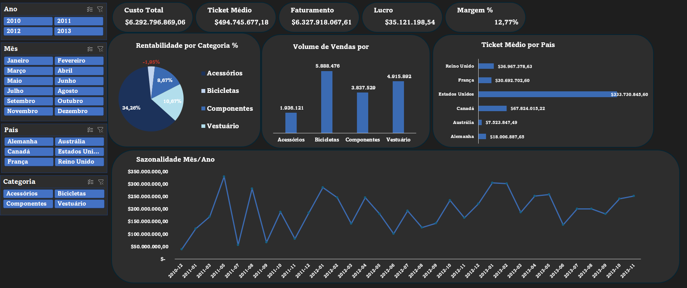
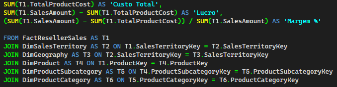

# 📊 Análise de Vendas com SQL e Excel

Este é meu primeiro projeto completo de análise de dados. Utilizei o **SQL** para extração e tratamento dos dados, e o **Excel** para criação de um dashboard interativo.

## 🎯 Objetivo

O objetivo do projeto foi aplicar na prática os conhecimentos teóricos adquiridos sobre análise de dados. Além do uso da linguagem SQL para consulta e estruturação das informações, o Excel foi usado para visualização, permitindo explorar métricas como:

- Faturamento total
- Lucro
- Margem de lucro (%)
- Ticket médio por pedido

## 🛠️ Ferramentas utilizadas

-  **SQL Server**
-  **Excel**
-  **Power Query**

- ## 🔍 Principais insights

- 🚲 **Bicicletas** lideram em volume de vendas (5.888.476 unidades).
- 📉 **Vestuário** apresenta margem negativa (-1,95%), indicando prejuízo.
- 💰 **Estados Unidos** possuem o maior ticket médio (R$ 333,7 milhões).
- 📅 Vendas apresentam **sazonalidade**, com picos em determinados meses do ano.
- 🧩 **Componentes** têm ticket médio elevado e margem positiva, sendo uma categoria saudável.

## 📊 Dashboard
Visualização geral do desempenho de vendas.

## 🧾 Trecho da Query SQL

A lógica de extração e transformação dos dados foi construída utilizando SQL com uso de JOINs entre tabelas e agregações para cálculo de métricas de negócio.

